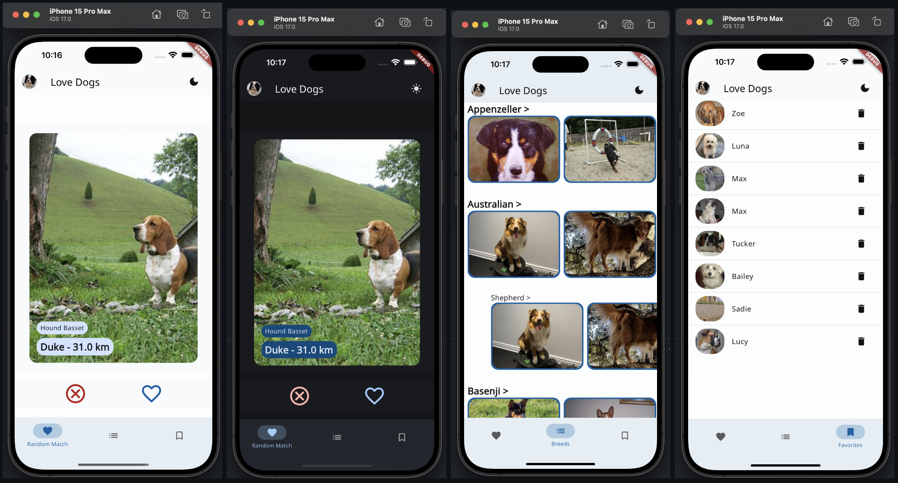
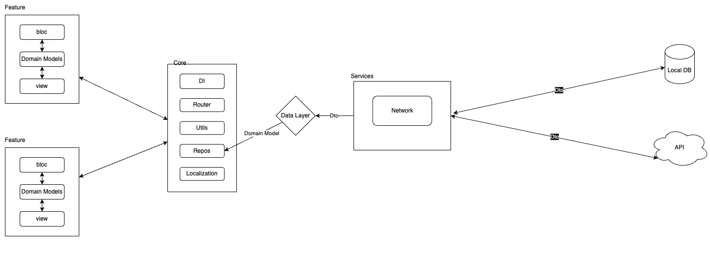

# Love Dogs - A Flutter Dating App for Dogs

[](https://github.com/dbbd59/ficcanaso)

I took inspiration from this dribble project:
https://dribbble.com/shots/19126306-Dating-App-for-Dogs

Welcome to 'Love Dogs', a fun and interactive Flutter application that brings the world of dating apps to our furry friends. This application allows you to like or dislike random dogs, filter by breeds, and see your liked dogs.



## Table of Contents

- [Features](#features)
- [Prerequisites](#prerequisites)
- [Installation](#installation)
- [Architecture](#architecture)
- [Testing](#testing)

## Features

- Go through random dog images and like or dislike them, just like a dating app.
- Filter dogs by breed to see dogs that match your preferences.
- View your liked dogs in a separate section.

## Prerequisites

Before you get started, make sure you have the following prerequisites:

- Flutter and Dart installed on your development machine. Stable Channel

## Installation

To install and run Dog Tinder on your local machine, follow these steps:

1. Clone this Git repository to your local machine:

```bash
git clone <repository-url>
```

2. move into the cloned directory:

```bash
cd love_dogs
```

3. Run the following command to install dependencies:

```bash
flutter pub get
```

4. Run the application:

```bash
flutter run
```

## Architecture

The codebase is structured to separate concerns and ensure code maintainability and scalability.



## Testing

> For the purpose of this project, I test only one part of the application and do only one type of test for each type.

### E2E

It's using fluttium for end to end testing

https://fluttium.dev/docs/getting-started

- install fluttium:

```bash
flutter pub global activate fluttium_cli
```

- run it:

```bash
fluttium test test/e2e/random_match_flow.yaml
```

- results:

```bash
  Random Match like and favorites.

  ✅  Expect visible "Love Dogs"
  ✅  Press on "Like"
  ✅  Press on "Favorites"
  ✅  Expect visible "Favorite_0"
  ✅  Press on "RandomMatch"
  ✅  Press on "Like"
  ✅  Press on "Favorites"
  ✅  Expect visible "Favorite_1"
```

### Unit and UI

- run it:

```bash
flutter test
```

- UI test uses golden screenshots to test the UI. the results are stored in 'test/ui/goldens'.

- Unit test is used to test the business logic. in this case the state management.
